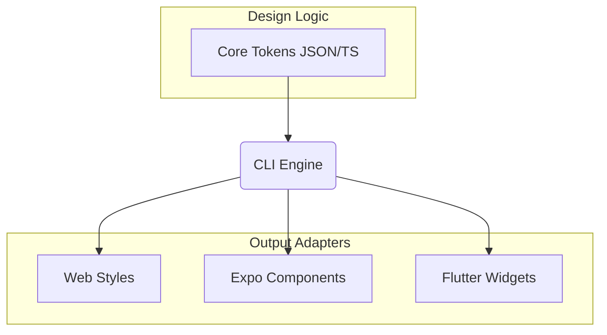

# 🛸 GetLotUI

> **The Unified, Token-Driven Design System for Every Platform.**

GetLotUI is a high-performance, platform-agnostic design system built on a **"Token-First"** architecture. It allows developers to define design intent once and deploy it across **Web**, **Expo (React Native)**, and **Flutter** with pixel-perfect consistency.
 
[](https://opensource.org/licenses/MIT)
[]()
[](https://pnpm.io/)
 
---

## 🤔 Why GetLotUI?

Maintaining a consistent design system across Web and Mobile is notoriously difficult. Developers often end up duplicating styles in CSS, React Native Stylesheets, and Dart, leading to **brand drift** and maintenance nightmares.

**GetLotUI solves this by:**
1. **Centralizing Truth**: Every color, font size, and spacing unit lives in a single JSON source.
2. **Native Performance**: No runtime translation layers. We generate native code for each platform.
3. **Developer Experience**: Use a familiar CLI to "add" components just like shadcn/ui.

---

## 🎨 Design Philosophy

- **Atomic Tokens**: Every design decision is a token.
- **Contract over Implementation**: Define *what* a component does before deciding *how* it's rendered.
- **Copy-Paste (Source-First)**: Components are copied into your repo. You own the code. No complex library dependencies.

---
 
## ✨ Features

- **🌐 Cross-Platform by Design**: First-class support for Web, Expo, and Flutter.
- **💎 Token-Driven Logic**: Change a color in your JSON tokens and watch it update across JS, Dart, and CSS.
- **🛠️ Powerful CLI**: Scaffold components and initialize projects with a single command.
- **📦 Monorepo powered by PNPM**: Seamlessly link core logic with platform implementations.
- **📖 Live Documentation**: Built-in Next.js documentation site generated from your components.

---

## 📐 Architecture

GetLotUI separates **Design Intent** from **Platform Implementation**. This ensures that your brand identity remains consistent even if you change your tech stack.



### The Layered Model

| Layer | Responsibility | Technology | Output |
| :--- | :--- | :--- | :--- |
| **01. Token Layer** | Colors, Spacing, Typography | JSON / TypeScript | Design Variables |
| **02. Contract Layer** | Component Interfaces & Logic | TypeScript Interfaces | Prop Definitions |
| **03. Render Layer** | Platform-specific Views | React Native / Swift / Dart | The Visual UI |

---

## 🧩 Available Components

Scaffold these instantly using `npx getlotui add <name>`:

| Component | Expo | Flutter | Web |
| :--- | :---: | :---: | :---: |
| **Button** | ✅ | ✅ | ✅ |
| **Input** | ✅ | ✅ | ✅ |
| **Toast** | ✅ | 🚧 | ✅ |
| **Badge** | ✅ | 🚧 | ✅ |
| **Avatar** | ✅ | 🚧 | ✅ |
| **Card** | ✅ | ✅ | ✅ |
| **Dropdown** | ✅ | 🚧 | ✅ |

---

## 📁 Repository Structure

### 📦 Packages (`/packages`)
- **`@getlotui/core`**: The brain. Contains tokens, design system logic, and shared types.
- **`@getlotui/cli`**: The developer's Swiss Army knife. Used to manage the design system.
- **`@getlotui/expo`**: React Native (Expo) implementation of the GetLotUI components.
- **`@getlotui/flutter`**: Flutter implementation using Dart tokens.
- **`@getlotui/web`**: Web implementation (Tailwind CSS and React).

### 🧪 Apps (`/apps`)
- **`documentation`**: The official Next.js documentation website.
- **`expo-playground`**: Sandbox for testing Expo components.
- **`flutter-playground`**: Sandbox for testing Flutter components.

---

## 🚀 Getting Started

### 1. Prerequisites
Ensure you have [Node 20+](https://nodejs.org/) and [pnpm](https://pnpm.io/) installed.

```bash
npm install -g pnpm
```

### 2. Installation
Install dependencies for all workspaces:

```bash
pnpm install
```

### 3. Development
- **Run Docs**: `pnpm --filter documentation dev`
- **Run Expo Sandbox**: `pnpm --filter expo-playground start`
- **Run Flutter Sandbox**: `cd apps/flutter-playground && flutter run`

---

## 🛠️ CLI Usage

The GetLotUI CLI allows you to easily integrate the design system into any project.

### Initialize a project
Automatically detects your framework (Expo, Flutter, or Web) and sets up the configuration.
```bash
npx getlotui init
```

### Add a component
Fetch a pre-styled component from the GetLotUI library.
```bash
npx getlotui add button
npx getlotui add card
```

---

## ⚙️ Road Map
- [x] Expo Implementation
- [x] CLI Foundation
- [x] Flutter Support (Beta)
- [ ] Web Components (Alpha)
- [ ] Figma to Token Sync
- [ ] Automated Visual Regression Testing

---

## 📜 License
MIT © 2026 GetLotUI Team. Built with ❤️ for the community.